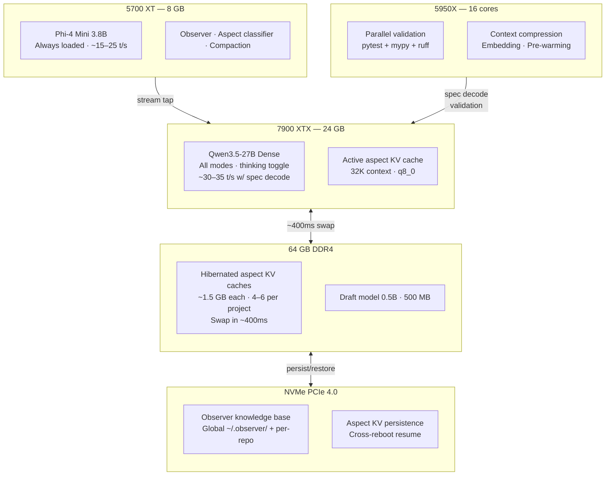
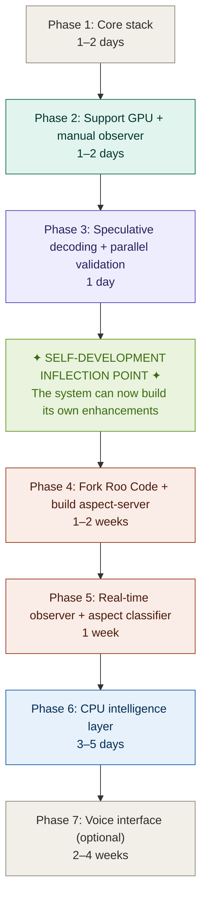
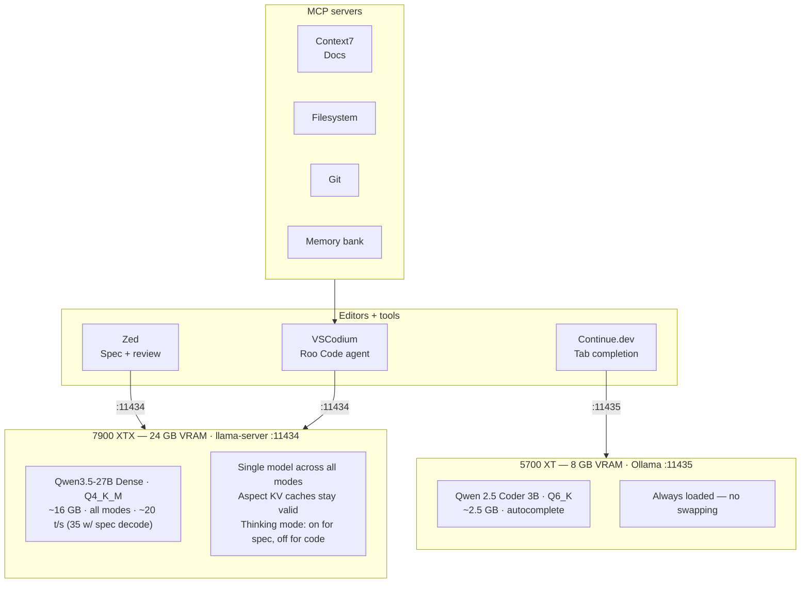
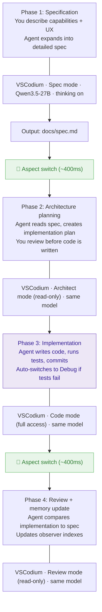
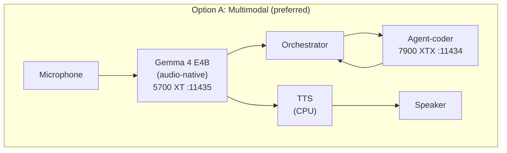
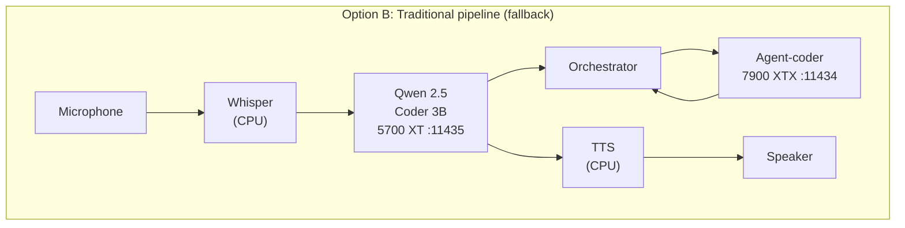
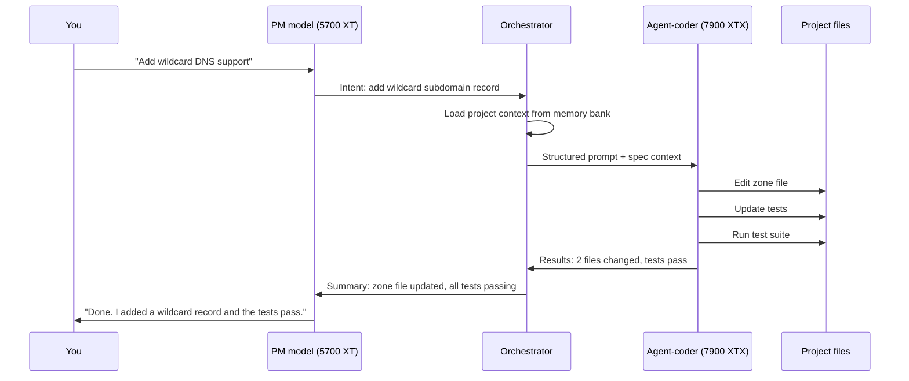

# Local Agentic Coding Stack: A Complete Guide

**For a 7900 XTX + 5700 XT workstation running Ubuntu**
**Written April 2026**

---

> **Status (2026-04-29): this guide describes the original design intent
> for the secondary GPU. The actual built stack diverged.** The 5700 XT
> does not run a Phi-4-Mini observer / aspect classifier / voice
> pipeline. It runs three llama-server sidecars: Qwen3-4B (Library
> summarize, :11435), multilingual-e5-large (Library embed, :11437), and
> Qwen2.5-Coder-3B (Zed edit prediction, :11438). All three on Vulkan,
> co-resident, validated under 2-hour load on 2026-04-29. For the
> as-built service map see `Workstation/docs/ports-registry.md` and
> `Workstation/docs/tries-and-takeaways.md` (2026-04-29 entry). The
> "support intelligence" framing below — observer, aspect classifier,
> voice — was never built; treat those phases as archived design intent,
> not a current roadmap.

---

## Executive summary

### What problems this solves

Local agentic coding — letting an AI agent write, test, and commit code on your own hardware with no cloud dependency — is possible today. But every team and individual who tries it hits the same walls:

**The agent forgets everything between sessions.** Each conversation starts from zero. Decisions made yesterday, mistakes corrected last week, your preferences refined over months — all gone. The agent re-derives the same conclusions, makes the same errors, asks the same questions. You become the memory, repeating yourself endlessly.

**Context is a single undivided pool that fills up fast.** A 32K-token window sounds large until the system prompt, rules, file contents, and conversation history compete for it. By exchange 15, quality degrades. By exchange 30, the agent is forgetting its own instructions. Working on multiple aspects of a project — tests, security, deployment — in the same session means each topic gets a fraction of the attention it needs.

**Switching focus destroys accumulated understanding.** Starting a fresh context to work on a different area means 15–25 seconds of reprocessing and total loss of the previous conversation's state. Switching models (a reasoning model for planning, a fast model for coding) is worse — every pre-computed context in the system becomes invalid.

**Most of your hardware sits idle.** A typical setup uses the primary GPU and ignores everything else. The secondary GPU runs autocomplete for a user who doesn't type code. The 16-core CPU idles during generation. 30+ GB of free RAM holds nothing. A fast NVMe serves occasional file reads. Four resources doing almost nothing while one resource does everything.

**There's no learning loop.** The agent never gets better at working with you specifically. It doesn't notice that you always prefer Flask over FastAPI, that "responsive" in your vocabulary means low-latency, or that your projects always need health checks. Every session is a first date.

**Tool-calling with local models is unreliable.** MoE models are fast but need retries on complex tasks. Dense models are reliable but slow. Switching between them for different phases destroys the context architecture. There's no good single-model answer — until you optimize the infrastructure around the model instead of swapping the model itself.

### What the complete system looks like



This guide builds a local development environment where every component in your workstation has a defined role:

**The 7900 XTX (24GB)** runs a single model — Qwen3.5-27B — across all development phases. One model means aspect KV caches stay valid, speculative decoding stays consistent, and you never pay a model-swap penalty. Thinking mode toggles between deep reasoning (spec, review) and fast generation (implementation) without changing models.

**The 5700 XT (8GB)** runs Phi-4 Mini (3.8B) as a permanent support intelligence layer. It watches the primary agent's conversation stream and extracts structured learnings into an indexed knowledge base. It detects when you've shifted topics and triggers aspect switches. It periodically consolidates the knowledge base, merging duplicates and promoting frequently-used observations. It does not participate in the coding conversation — it observes and learns.

**The 64GB DDR4** holds hibernated aspect contexts. Each aspect of your project (zone management, testing, security, deployment) gets its own dedicated 32K-token context that freezes to RAM when inactive and restores in ~400ms when you return. Instead of five topics sharing one context at ~4K tokens each, each topic gets ~20K tokens to itself — a 4–5x improvement in effective depth.

**The 5950X CPU (16 cores)** runs parallel validation (pytest + mypy + linting simultaneously with the agent's next edit), speculative decoding (a 0.5B draft model predicts tokens ahead on CPU), context compression (a 1.5B model summarizes old conversation history to reclaim context space), and codebase embedding (continuous semantic indexing for the agent's file searches).

**The NVMe** persists aspect KV states across reboots, stores the observer's dual-scope knowledge base (global preferences that follow you + project observations that travel with each repo in git), and provides ~7GB/s reads for near-instant state restoration.

**VSCodium + a forked Roo Code** is the single editor. The fork adds aspect-switching integration, a conversation event stream for the observer, and llama-server slot management. Zed stays installed as a lightweight file viewer. No AI configuration, no model assignments — just a fast reader.

The result: an agent that remembers what it's learned about you and each project, switches focus in 400ms without losing context, runs at ~30–35 tokens/second with speculative decoding, never waits for tests (CPU runs them in parallel), and gets complex tasks right on the first try more often than faster models because first-try reliability was the model selection criterion.

### Phased rollout

Each phase produces a functional system. Later phases enhance what earlier phases built — nothing is throwaway work.



**Phase 1: Core stack** (estimated: 1–2 days)
Install llama-server with ROCm, download Qwen3.5-27B, configure Roo Code in VSCodium, set up rules files and the memory bank. At the end of this phase you have a fully functional local agentic coding environment: you describe what you want, the agent builds it, tests it, and commits it. No cloud dependency. No subscriptions. All data stays on your machine.
*Functional win: You can develop software locally with an AI agent.*

**Phase 2: Support GPU + manual observer** (estimated: 1–2 days)
Configure the 5700 XT with Ollama, load Phi-4 Mini. Write the observer extraction script. After each coding session, export the conversation and run it through the extraction prompt. Review the observations, classify them as global or project-scoped, and add them to the appropriate index files. Add the global rule that tells the primary agent to read the observer indexes at session start.
*Functional win: The agent starts each session knowing what it learned from previous sessions. You have a structured, growing knowledge base.*

**Phase 3: Speculative decoding + parallel validation** (estimated: 1 day)
Add the 0.5B draft model to llama-server's launch flags. Build the CPU-side file-change watcher that runs pytest + linting after each agent edit. These are independent of each other and each improves throughput immediately.
*Functional win: The agent generates ~50–75% faster on predictable code. Tests run in parallel with the next edit — neither the GPU nor the CPU waits for the other.*

> **Inflection point: after Phase 3, you can use this system to develop itself.** The Roo Code fork, the aspect-server, the real-time observer — these are all Python and TypeScript projects with clear specs. The agent can write them, test them, and iterate on them using the exact environment they're designed to improve. From this point forward, every enhancement to the system is built by the system.

**Phase 4: Fork Roo Code + build aspect-server** (estimated: 1–2 weeks)
Fork Roo Code. Add the llama-server slot API handler, the aspect-switching UI, and the conversation event stream. Build the aspect-server wrapper in Python — slot management, aspect registry, KV cache save/restore. Create `.aspects.yaml` for your first project. Test manual aspect switching.
*Functional win: Aspect switching works. Each topic gets the full context window. Switching focus costs ~400ms instead of 15–25 seconds, with full conversation history preserved.*

**Phase 5: Real-time observer + aspect classifier** (estimated: 1 week)
Connect the observer to the Roo Code fork's conversation event stream. Enable real-time extraction on the 5700 XT. Add the aspect classifier — topic-transition detection that triggers automatic aspect switches. Build the compaction job for index maintenance.
*Functional win: The system learns continuously without manual export. Aspect switches happen automatically when you shift topics. The knowledge base maintains itself.*

**Phase 6: CPU intelligence layer** (estimated: 3–5 days)
Add context compression (1.5B model on CPU, summarizes old conversation history to reclaim context space). Add codebase embedding (semantic index for the agent's file searches). Add predictive aspect pre-warming (CPU pre-computes the next likely aspect's KV state before you switch).
*Functional win: Full hardware utilization. Every component in the system has a defined role. Context never runs out — old history compresses automatically. File searches use semantic matching instead of brute-force reading.*

**Phase 7: Voice interface** (estimated: 2–4 weeks, optional)
Build the voice pipeline on the 5700 XT — either a multimodal model (Gemma 4 E4B) or Whisper + a small PM model. Build the orchestrator that bridges voice commands to the coding agent. This is the most experimental phase and the least critical for productivity.
*Functional win: You speak intentions instead of typing them. The full conversational coding flow from Appendix A.*

### Feasibility assessment — what's easy, what takes work, and where you'll find friction

Every claim in this guide was verified against current (April 2026) software. Here's the honest breakdown.

**Easy — works today, minimal setup:**

*llama-server with ROCm on the 7900 XTX.* RDNA 3 (gfx1100) is officially supported. Flash attention, q8_0 KV cache, speculative decoding with a CPU draft model — all confirmed working. People run Qwen3-Coder and Qwen3.5-27B on 7900 XTX daily.

*Roo Code with llama-server.* Roo Code supports "OpenAI Compatible" as a provider, and llama-server exposes an OpenAI-compatible API. This is a known, tested configuration. There are open issues with specific models, but the plumbing works.

*Speculative decoding on CPU.* llama-server's `-md` and `-devd none` flags are stable. Running a 0.5B draft model on CPU while the main model runs on GPU is a documented, working feature. Throughput gains of 1.3–1.8x on coding tasks are realistic.

*q8_0 KV cache.* Halves context VRAM cost. Well-tested, supported across all recent models. No controversy here.

*Dual Ollama instances on separate GPUs.* Standard multi-GPU Ollama setup. Pin with `ROCR_VISIBLE_DEVICES`. Works.

*Observer: post-session batch extraction.* This is just a script that feeds conversation exports to a local model and writes structured output to files. No exotic dependencies. You could build this in an afternoon.

*The memory bank and rules files.* Pure markdown files the agent reads. No infrastructure needed. Works today with stock Roo Code.

**Takes work — components exist but require integration or custom code:**

*KV cache save/restore to disk via slot API.* The `/slots/{id}/save` and `/slots/{id}/restore` endpoints exist and work for text-only models. However, there's an open bug: slot save fails for vision-enabled models (the mmproj files cause issues). Since Qwen3.5-27B is multimodal, this could hit you. **Mitigation:** If slot save/restore breaks with the multimodal GGUF, use the text-only GGUF variant of Qwen3.5-27B (no vision encoder). You don't need vision for coding. This is the single highest-risk technical dependency in the architecture.

*Host-memory prompt caching (`--cache-ram` / `--cram`).* This was merged in PR #16391 and is now enabled by default (8GB). It stores computed prefixes in system RAM and hot-swaps them into GPU context automatically. This is actually *better* than the manual slot save/restore approach described in the guide — llama-server now does aspect-like prefix caching natively. The aspect-server wrapper may be simpler than originally planned: instead of manual save/restore calls, you configure `--cram` with enough RAM for your aspects and let llama-server's built-in prefix matching handle the hot-swapping. **This is a significant simplification discovered during this review.** The ~400ms swap time estimate may be conservative — hot-swaps from RAM cache may be faster.

*Forking Roo Code.* The codebase is TypeScript, Apache 2.0, well-structured with a clear API handler architecture. The provider system is modular (20+ providers with validation). Adding a llama-server-specific handler is straightforward. The conversation event stream requires more surgery — you'd need to add event emission hooks in the message processing pipeline. Estimate: 1–2 weeks for a competent TypeScript developer (which the agent is, after Phase 3).

*The aspect-server wrapper.* A Python service that manages llama-server lifecycle and aspect registry. ~500–1000 lines. No exotic dependencies. The `--cram` discovery simplifies this substantially — you may not need explicit slot save/restore at all if the built-in RAM caching handles your prefix patterns well enough.

*Observer: real-time stream tap.* The transparent proxy approach (sit between Roo Code and llama-server, copy the stream) is a known pattern. FastAPI can do this in ~100 lines. The Roo Code fork approach (emit events directly) is cleaner but requires the fork to be done first.

*5700 XT with ROCm.* RDNA 1 is unsupported. The `HSA_OVERRIDE_GFX_VERSION=10.1.0` override works for many people but not all. Vulkan fallback is slower but more reliable. For Phi-4 Mini at 3.8B, even Vulkan gives ~15 t/s — acceptable for observer work. **Friction point:** Budget time for GPU driver debugging on this card. If ROCm doesn't cooperate after a day, switch to Vulkan and move on.

*Parallel CPU validation.* A file-change watcher that triggers pytest is simple (watchdog + subprocess). The integration with Roo Code's workflow — making the agent aware that validation is running in parallel and results will arrive asynchronously — requires either modifying the Roo Code fork or having the agent check a results file. Not hard, but not zero-effort either.

*Codebase embedding on CPU.* Running nomic-embed-text or a small embedding model via llama-server on CPU works. Connecting it to Roo Code's codebase indexing feature requires configuring an OpenAI-compatible embedding endpoint, which Roo Code supports.

**Hard — requires significant custom work or has known limitations:**

*Automatic aspect transition detection.* Having Phi-4 Mini classify whether you've shifted topics in real-time is conceptually simple but practically tricky. The classifier needs to run fast enough to not introduce latency, needs access to the aspect registry for context, and needs a threshold for confidence before triggering a switch. Too eager = disruptive switches mid-thought. Too conservative = you switch manually every time anyway. Expect substantial tuning. **Start with manual switching and add the classifier later.**

*Context compression on CPU.* Running a 1.5B model to summarize old conversation history and inject the summary back into the KV state is possible in theory but has no off-the-shelf implementation. You'd need to: run the compression model, generate a summary, construct a new prompt with the summary replacing the verbose history, and recompute the KV state for the new prompt. The recomputation step costs ~10–15 seconds (full prompt reprocess) — it's not a transparent swap. **This works but the latency cost is higher than the guide implies.** Best used between sessions (compress overnight) rather than live.

*Predictive aspect pre-warming.* Pre-computing a KV state for the "next likely aspect" on CPU requires running the full model on CPU for prompt processing. Qwen3.5-27B on CPU would be extremely slow (~0.5 t/s). This only works if you use a much smaller model for pre-warming (which produces a different KV state, so it's useless) or if you pre-warm on the GPU during idle moments (which competes with the active aspect). **This feature as described is not practical.** Drop it from the plan. The `--cram` host-memory cache achieves a similar goal more naturally — previously-computed prefixes stay warm in RAM without explicit prediction.

*Voice interface (Phase 7).* Gemma 4 E4B on the 5700 XT via RDNA 1 is uncertain. Audio-native multimodal models have specific compute requirements that may not work with the GFX version override. The Whisper + small LM pipeline is safer but requires more integration. **This is genuinely experimental.** It works on NVIDIA and Apple Silicon; AMD RDNA 1 is uncharted territory.

**Not feasible as described — needs a different approach:**

*Saving KV cache to RAM and restoring in ~400ms as described in the original aspect-switching architecture.* The guide describes manually saving/restoring entire KV states between named slots in RAM. While `--slot-save-path` supports saving to disk, and `--cram` supports host-memory caching, the specific pattern of "name this state 'zones', freeze it, name this other state 'tests', thaw it" isn't a direct API feature. **However**, the `--cram` host-memory caching achieves the functional equivalent automatically: when you switch conversation topics, the old prefix stays in the RAM cache, and if you switch back, llama-server recognizes the prefix match and skips reprocessing. The 400ms swap estimate is plausible for prefix restoration from RAM. The difference is that this is implicit (based on prompt prefix matching) rather than explicit (named aspect states). **The build plan should use `--cram` as the primary mechanism and fall back to `--slot-save-path` for cross-session persistence to NVMe.**

### Reading the rest of this document

Parts 1–12 cover the core stack and its configuration — everything you need for Phases 1–3. Appendix A covers the voice interface (Phase 7). Appendix B covers the support intelligence layer, observer, and aspect-switching system (Phases 4–5). Appendix C covers CPU utilization (Phase 6).

---

## How to read this document

Sections are ordered in the sequence you'd actually set things up. Within each section, the **recommended path** comes first, followed by **alternatives and their tradeoffs**. When a decision has meaningful performance implications, you'll see a callout like this:

> **Performance note:** What changes and why.

If you're already comfortable with a topic, skip to the next section. If something is unfamiliar, the surrounding explanation is written to make you self-sufficient in that area.

---

## Part 1: Understanding your hardware budget

Before choosing any software, you need a mental model of what your hardware can and can't do. Every decision downstream flows from two numbers: how much VRAM you have and how fast that VRAM can be read.

### What VRAM actually does

When you run a language model, the model's weights (its "brain") get loaded into GPU memory. A 30-billion-parameter model at 4-bit quantization occupies roughly 18GB. On top of that, the model needs a **KV cache** — working memory that grows as the conversation gets longer. A 32K-token context window costs approximately 2–4GB of additional VRAM, depending on the model architecture.

Your two GPUs give you two completely independent VRAM pools:

| GPU | VRAM | Architecture | ROCm status | Role |
|-----|------|-------------|-------------|------|
| RX 7900 XTX | 24GB | RDNA 3 (gfx1100) | Officially supported | Primary: agentic coding models |
| RX 5700 XT | 8GB | RDNA 1 (gfx1010) | Unsupported but functional with override | Secondary: support intelligence (observer, aspect classifier) |

These pools cannot be combined. You can't load a single model across both GPUs because they're different architectures. The primary GPU runs llama-server; the secondary runs Ollama. They never compete for resources.

### System architecture overview



The key insight: **the two GPUs never interfere with each other.** The primary GPU handles the heavy agentic workload with models that swap in and out as you change phases. The secondary GPU holds a small, always-resident autocomplete model without competing for primary VRAM.

### Your system RAM matters too

Your 64GB DDR4 serves two purposes. First, it's regular system memory for your OS, editors, and tools. Second, it's a **spillover pool** for model weights that don't fit in VRAM. When a model is too large for the GPU, Ollama automatically offloads some layers to system RAM. This works, but with a massive speed penalty — system RAM bandwidth is roughly 50GB/s versus the 7900 XTX's 960GB/s. Every layer that spills to RAM makes the model noticeably slower.

> **Performance note:** A model that fits entirely in VRAM might generate 70+ tokens per second. The same model with 20% of layers offloaded to RAM might drop to 15–25 tokens/second. With 50% offloaded, expect 5–12 tokens/second. The relationship isn't linear — even a small amount of spillover has a disproportionate impact on speed because every token generation requires reading through all layers sequentially.

### The 5950X CPU

Your Ryzen 9 5950X has 16 cores and 32 threads. For LLM inference, the CPU mainly matters during **prompt processing** (when the model reads your input) rather than **token generation** (when it writes its response). A fast CPU helps process long prompts faster but doesn't meaningfully speed up generation. Where your CPU really earns its keep is running everything else simultaneously — your editors, file watchers, MCP servers, and git operations.

---

## Part 2: Setting up the inference layer

The inference layer is the software that actually runs language models. Everything else — editors, agents, MCP servers — talks to this layer via HTTP API calls. Getting it right here determines the ceiling for everything above.

### Installing ROCm

ROCm is AMD's GPU computing platform — the equivalent of NVIDIA's CUDA. Ollama uses it to run models on your AMD GPUs.

```bash
# Download and install the AMD GPU driver with ROCm support
wget https://repo.radeon.com/amdgpu-install/latest/ubuntu/noble/amdgpu-install_*_all.deb
sudo dpkg -i amdgpu-install_*.deb
sudo amdgpu-install --usecase=rocm --no-dkms

# Add your user to the required groups
sudo usermod -aG render,video $USER

# Reboot for group changes to take effect
sudo reboot
```

After rebooting, run `rocminfo` to verify both GPUs are detected. Note which device index (0 or 1) maps to which GPU — you'll need this to pin each Ollama instance to the correct card. The 7900 XTX will likely be device 0 and the 5700 XT device 1, but verify.


### Configuring the primary inference server (7900 XTX)

The primary GPU runs **llama-server** (from llama.cpp), not Ollama. This is required for the aspect-switching system in Appendix B — Ollama doesn't expose slot-level KV cache management. llama-server also handles Qwen3.5 correctly, which is currently broken in Ollama due to separate mmproj vision files.

Build llama.cpp with ROCm support:

```bash
git clone https://github.com/ggml-org/llama.cpp
cd llama.cpp
cmake -B build -DGGML_HIP=ON -DAMDGPU_TARGETS=gfx1100
cmake --build build --config Release -j$(nproc)
```

Launch the server:

```bash
HSA_OVERRIDE_GFX_VERSION=11.0.0 \
GPU_MAX_HEAP_SIZE=100 \
GPU_MAX_ALLOC_PERCENT=100 \
./build/bin/llama-server \
  -m /path/to/qwen3.5-27b-q4_k_m.gguf \
  -md /path/to/qwen2.5-coder-0.5b-q8_0.gguf \
  -ngl 99 \
  -c 32768 \
  --flash-attn \
  -ctk q8_0 -ctv q8_0 \
  --jinja \
  -devd none \
  --draft-max 16 --draft-min 4 \
  --slot-save-path /tmp/aspects/ \
  --numa distribute \
  --host 127.0.0.1 --port 11434
```

What each flag does:

- `-m` — The primary model. Qwen3.5-27B at Q4_K_M (~16GB VRAM).
- `-md` — The speculative draft model (Qwen 2.5 Coder 0.5B), runs on CPU to predict tokens ahead of the main model.
- `-ngl 99` — Offload all model layers to GPU.
- `-c 32768` — 32K context window per slot. With q8_0 KV cache, this costs ~1.2GB.
- `--flash-attn` — Flash Attention for faster prompt processing on RDNA 3.
- `-ctk q8_0 -ctv q8_0` — Quantize KV cache to 8-bit. Halves context VRAM cost with negligible quality loss.
- `--jinja` — Required for Qwen3.5's tool-calling chat templates and thinking mode toggle.
- `-devd none` — Keep the draft model on CPU, not GPU.
- `--draft-max 16` — Speculative decoding: draft up to 16 tokens ahead. On structurally predictable code, 60–80% are accepted, boosting throughput from ~20 t/s to ~30–35 t/s.
- `--slot-save-path` — Enables KV cache save/restore for aspect switching (Appendix B).
- `--numa distribute` — NUMA-aware scheduling for the 5950X's dual-CCD chiplets. 10–20% prompt processing speedup.

> **Performance note:** At 32K tokens with q8_0, the KV cache costs ~1.2GB. At 48K, ~1.8GB. Qwen3.5-27B at Q4_K_M uses ~16GB for weights, leaving ~8GB for KV cache + overhead on your 24GB card. You can push to 48K comfortably. At Q5_K_M (~20GB weights), 32K context is the practical ceiling.

> **Thinking mode:** Qwen3.5-27B supports toggling thinking on/off per request via the `--jinja` flag. Enable thinking for spec writing and architecture (quality matters, speed doesn't). Disable for implementation (speed matters, the spec already contains the reasoning). Roo Code can send the thinking toggle via the chat completion API.

llama-server exposes an OpenAI-compatible API on port 11434. Roo Code connects to it the same way it connects to Ollama — set the base URL to `http://localhost:11434` and the model name to the filename stem.

### Configuring the secondary Ollama instance (5700 XT)

The 5700 XT runs Ollama for its support intelligence role (simpler than llama-server for a permanently-loaded small model). Create a separate systemd service:

```bash
ROCR_VISIBLE_DEVICES=1 \
HSA_OVERRIDE_GFX_VERSION=10.1.0 \
OLLAMA_HOST=127.0.0.1:11435 \
OLLAMA_FLASH_ATTENTION=0 \
OLLAMA_MAX_LOADED_MODELS=2 \
GPU_MAX_HEAP_SIZE=100 \
GPU_MAX_ALLOC_PERCENT=100 \
ollama serve
```

Key differences from the primary:

- `ROCR_VISIBLE_DEVICES=1` — Pins to the 5700 XT.
- `HSA_OVERRIDE_GFX_VERSION=10.1.0` — The 5700 XT is gfx1010. If this doesn't work, try `10.3.0`. If neither works, try `OLLAMA_VULKAN=1` instead — Vulkan is slower but more universally compatible.
- `OLLAMA_FLASH_ATTENTION=0` — RDNA 1 has limited Flash Attention support.
- Port `11435` — Different from the primary's 11434.

Pull the support intelligence model:

```bash
OLLAMA_HOST=127.0.0.1:11435 ollama pull phi4-mini
```

> **Performance note:** If ROCm fails for the 5700 XT but Vulkan works, expect ~15 t/s instead of ~25 t/s for Phi-4 Mini. Both are fast enough for observer extraction and aspect classification.

### Model parameters and what they do

**Context window (`-c` / `num_ctx`)** — How much text the model can "see" at once. 32,768 is the recommended default. With aspect switching, each aspect gets the full 32K to itself.

**Generation limit (`--predict` / `num_predict`)** — Maximum tokens per response. Set to 12,000 (~40–50KB of code). Ollama's default is too low for file generation. llama-server defaults to unlimited, but setting a cap prevents runaway generation.

**Temperature** — Controls randomness. 0.7 is a good default for coding. Drop to 0.3–0.5 for precise refactoring. Raise to 0.8–0.9 for brainstorming. No impact on speed or VRAM.

**Repeat penalty** — Discourages repetition loops. 1.1 is safe. Above 1.3 risks incoherent output.

**Why a single model, not two:** KV caches are model-specific — a cache computed by one model is meaningless to another. Swapping models invalidates every hibernated aspect KV in RAM (Appendix B), destroying the ~400ms aspect-switching architecture. Qwen3.5-27B is sufficient for all phases: it produces the cleanest code in real-world agentic testing, gets complex tasks right on the first try more often than MoE alternatives, and its thinking mode toggle lets you trade speed for reasoning depth per-request without swapping models.

### The model landscape: what to choose and why

**Qwen3.5-27B (Dense) — The recommended single model.** 27B dense parameters, ~16GB at Q4_K_M, ~20GB at Q5_K_M. In real-world agentic testing, it produced the most correct and cleanest code — right API usage, type hints, docstrings, pathlib. Got complex multi-step tasks right on the first try where MoE models needed retries. Speed is ~20 t/s native, ~30–35 with speculative decoding. 130K native context. Thinking mode toggles between fast and deep reasoning. Broken in Ollama (mmproj issue) but works in llama-server. Apache 2.0.

**Qwen3-Coder-30B-A3B (MoE)** — The previous recommendation. 30B total, 3.3B active. Much faster (~70 t/s) but less reliable on complex tasks. Valid if you prioritize raw speed over first-try reliability.

**Gemma 4 26B-A4B (MoE)** — Best native function-calling reliability. Rock-solid compilation rates. But weakest code quality in head-to-head testing. Best as a fallback if tool calling proves unreliable with Qwen3.5-27B.

**Qwen 2.5 Coder 32B (Dense)** — Highest raw benchmark scores but no thinking mode, no vision. Only consider as a full replacement, never a swap-in alongside another model.

**Gemma 4 31B (Dense)** — Strong general reasoning, native vision. Consider only as a full replacement if it outperforms Qwen3.5-27B on your specific workload.

### Quantization: what the numbers mean

Models come in different precision levels. The naming convention (Q4_K_M, Q5_K_M, Q6_K, Q8_0) tells you how many bits each parameter uses:

- **Q4_K_M (4.83 bits)** — The standard for 24GB cards. Retains roughly 92% of full-precision quality. This is the default recommendation.
- **Q5_K_M (5.33 bits)** — Noticeably better than Q4 on complex reasoning tasks. Uses ~15% more VRAM. Worth it when you have the headroom.
- **Q6_K (6.56 bits)** — Diminishing returns above Q5 for coding tasks. Mainly useful for smaller models where you have VRAM to spare (like the 3B on the secondary GPU).
- **Q8_0 (8.0 bits)** — Near-lossless. Only practical for small models (7B and under) on your hardware.
- **Q3_K_M and below** — Noticeable quality degradation. Avoid unless you're trying to fit a model that otherwise won't work at all.

> **Performance note:** Higher quantization (more bits) doesn't make generation slower in any meaningful way — the bottleneck is memory bandwidth, not computation. What it does is increase VRAM usage, which either means less room for context or forces layer offloading to RAM (which does make things slower). The decision is: better quality per token vs. more tokens of context. For agentic coding where the agent needs to hold a spec, multiple files, and conversation history in context simultaneously, context size usually wins. That's why Q4_K_M is the default recommendation.

### VRAM budget: how different configurations divide 24 GB

The following table shows three configurations and what fits. "KV cache" is the working memory that grows with context length — it determines how much the agent can "see" at once.

| | Recommended (dual GPU) | Single GPU (no 5700 XT) |
|---|---|---|
| **Agent model** | 27B Dense Q4_K_M · 16 GB | 27B Dense Q4_K_M · 16 GB |
| **Autocomplete** | — (5700 XT runs support intelligence) | 1.5B Q6 · 1.5 GB |
| **KV cache (context, q8_0)** | ~1.5 GB (32K tokens) | ~1.5 GB (32K tokens) |
| **Free / overhead** | ~1.5 GB | ~3 GB |
| **Total** | 24 GB | 24 GB |
| **Agent speed** | ~20 t/s (~35 w/ spec decode) | ~20 t/s (~35 w/ spec decode) |
| **Agent quality** | Best first-try reliability | Best first-try reliability |

A single model across all modes is essential for the aspect-switching architecture in Appendix B. Model swaps invalidate every hibernated KV cache in RAM, destroying the ~400ms aspect-switch capability. The MoE model's quality is sufficient for all phases — spec writing, architecture, implementation, review, and debugging — while maintaining 70 t/s throughput and aspect cache validity.

With q8_0 KV cache (recommended), context memory is halved compared to the default f16. This gives you meaningful headroom — enough to push context to 48K without VRAM pressure on the recommended dual-GPU setup.

> **Performance note:** With q8_0 KV cache, pushing context to 65K tokens costs ~3GB (the same as 32K at f16). On the recommended dual-GPU config, 65K context + Q5_K_M agent model totals ~24GB — tight but fits. This is a realistic option for tasks with large spec files. At 48K tokens (~2.2GB KV) you'd have comfortable headroom and significantly more working space than the 32K default.

---

## Part 3: The editor workflow

This is probably the most unfamiliar part of the stack if you're used to working in a single environment. The idea is simple: use each editor for what it's best at.

### Why one editor, not two

The original plan used Zed for spec conversations and VSCodium + Roo Code for implementation, with model switches enforcing phase boundaries. The aspect-switching architecture (Appendix B) made this unnecessary:

- **Context isolation** is now handled by aspect KV swaps in RAM (~400ms), not by switching applications.
- **Model switching invalidates all aspect caches**, so keeping one model across all modes is essential. With one model, there's no reason to spread work across two editors.
- **The observer and stream tap** (Appendix B) integrate with the Roo Code ↔ Ollama connection. Running a second editor's AI panel creates a second stream the observer would need to monitor — double the integration work for no benefit.
- **You don't navigate code** — the agent does. Zed's speed advantage helps developers who jump between files at keystroke speed. For your workflow, the agent reads and writes files; you read the agent's summaries.

**The recommendation: VSCodium + Roo Code as the single AI-integrated editor.** Keep Zed installed as a fast, lightweight file viewer for reviewing diffs and scanning project structure — no AI configuration, no Ollama connection, no model assignments. Just a fast reader.

### How the workflow flows

The following diagram shows the complete development cycle. Phase transitions are **aspect switches** (~400ms, full history preserved) rather than fresh contexts (15–25 seconds, history lost). All phases use the same model in the same editor.



**Phase 1: Specification** — Open Roo Code in Spec mode. Describe capabilities, logic, and UX. The agent expands your description into a detailed spec. The conversation happens in a "spec" aspect with its own dedicated context.

**Phase 2: Architecture planning** — Switch to Architect mode. The aspect manager swaps to the "planning" aspect (~400ms). The agent reads the spec file and creates an implementation plan. Architect mode is read-only — it can't modify files, only plan. Review the plan before any code is written.

**Phase 3: Implementation** — Switch to Code mode. Aspect swap to "implementation" (~400ms). The agent writes code, runs tests, commits. With auto-approve configured (Part 5), this runs largely unattended. If tests fail, the agent auto-switches to Debug mode (same aspect, no swap needed).

**Phase 4: Review** — Switch to Review mode. Aspect swap to "review" (~400ms). The agent compares implementation against the spec and reports gaps. The observer captures learnings throughout.

At any point, you can open Zed to scan files, read diffs, or visually verify the project structure. Zed is a viewer, not an AI participant.

---

## Part 4: Configuring the editor stack

### VSCodium + Roo Code (primary, AI-integrated)

Install VSCodium from your package manager or vscodium.com. Install Roo Code from the Open VSX Registry or download the VSIX from GitHub releases.

Connect Roo Code to Ollama: open the sidebar → settings gear → select "openai-compatible" as API Provider → enter the model name → base URL `http://localhost:11434/v1`.

### Zed (secondary, file viewer only)

Keep Zed installed but don't configure any AI features. No Ollama connection, no model assignments, no agent panel configuration. Use it purely for fast file navigation and diff review. This avoids any risk of Zed and Roo Code competing for the same Ollama instance, and keeps the observer's stream tap simple (one connection to monitor).

---

## Part 5: Configuring VSCodium + Roo Code

### Installation

Install VSCodium from your package manager or download from vscodium.com. Install Roo Code from the Open VSX Registry (search "Roo Code" in the extensions panel) or download the VSIX from their GitHub releases and install manually.

### Connecting to Ollama

Open the Roo Code sidebar → click the settings gear → select **"openai-compatible"** as the API Provider. Enter the model name (the GGUF filename stem). Base URL: `http://localhost:11434/v1`.

### Auto-approve settings for agentic flow

This is the most important configuration for reducing friction. Open Roo Code settings and configure:

**Auto-approve reads: ON.** The agent needs to freely explore your project to understand it. This is low-risk — reading files can't break anything.

**Auto-approve writes: ON, with write delay 2000ms.** When the agent edits a file, it waits 2 seconds before proceeding. During that window, VSCodium's diagnostics (the "Problems" panel) checks for syntax errors. If errors appear, the agent sees them and can self-correct. This is your primary safety net against bad edits.

> **Performance note:** The write delay adds 2 seconds per file edit. In a session where the agent creates or modifies 15 files, that's 30 seconds of waiting. Reducing it to 1000ms speeds things up but gives diagnostics less time to catch errors, leading to more back-and-forth correction cycles. For local models that make more mistakes than frontier models, the 2000ms delay typically saves net time.

**Auto-approve mode switching: ON.** Lets the agent switch between Architect, Code, and Debug without asking. Since you're not a coder, you want the agent to make these tactical decisions (e.g., switching to Debug when tests fail) without requiring you to understand when each mode is appropriate.

**Auto-approve subtasks: ON.** The agent can break work into subtasks and execute them sequentially. This is essential for autonomous operation.

**Auto-approve terminal commands: Conditional.** Use the allowlist/denylist system:

Allowlist (commands the agent can run without asking):
```
python
pip
npm
node
npx
pytest
git status
git diff
git add
git commit
git log
git branch
mkdir
touch
cat
ls
```

Denylist (commands that always require approval):
```
rm -rf
sudo
git push
git reset --hard
git rebase
docker
systemctl
chmod
chown
```

The denylist takes precedence over the allowlist when both match. `git` is broadly allowed, but `git push` and `git reset --hard` are specifically blocked. The agent can stage and commit locally but can't push to a remote or destroy history without your explicit approval.

**Auto-approve MCP tools: ON globally, then enable per-tool.** This is a two-step process — the global setting is a master switch, and each individual MCP tool has its own "Always allow" checkbox. Enable globally, then selectively enable tools you trust.

**Request limit: 60–80.** This is the circuit breaker. After this many tool calls in a single task, the agent stops and asks you to continue. Local models sometimes enter loops where they make the same edit, see it fail, revert, make it again. The request limit catches this. If the agent hits this limit, it's usually a sign that the context is polluted and you should start a fresh session.

### Custom modes

Roo Code's built-in modes (Architect, Code, Debug, Ask) work well out of the box, but your workflow benefits from a custom Review mode:

In VSCodium, open the Roo Code mode configuration and create:

**Mode: Review**
- Slug: `review`
- Role: "You are a code reviewer. Read the specification file and the implementation. Report any discrepancies, missing features, potential bugs, and deviations from the spec. Do not modify any files."
- Tools: Read-only (no file writes, no terminal commands)

This gives you a dedicated quality gate. After the Code mode finishes implementation, switch to Review mode. It reads the spec and the code and tells you what doesn't match. Since you're not reading the code yourself, this is how you verify the work.

**Mode: Spec**
- Slug: `spec`
- Role: "You are a product architect. The user will describe capabilities, logic, and desired user experience. Your job is to expand this into a detailed technical specification document. Ask clarifying questions. Define data models, APIs, file structure, and test criteria. Write the spec to a markdown file."
- Tools: Read files, write markdown only

This formalizes the specification phase. The spec mode can't write code — only markdown — so you're guaranteed to get a document, not an implementation.

---

## Part 6: Rules files — encoding your workflow

Rules files are markdown documents that get injected into the agent's system prompt at the start of every session. They're the closest thing to "permanent instructions" in the local stack. There are three levels:

### Global rules (apply to all projects)

Location: `~/.roo/rules/personal.md`

```markdown
# About the user
- Does not write code. Always provide complete, working implementations.
- Never provide code snippets or partial examples. Every code block must be a complete file.
- Workflow: define capabilities → spec in Spec/Architect mode → implement in Code mode → verify in Review mode. Each phase uses a fresh context.
- Prefers Python for backend unless there's a compelling reason for another language.
- All projects run on Ubuntu Linux with AMD GPUs. Never suggest CUDA-specific tools.
- Data sovereignty is paramount. Never suggest cloud APIs for processing data.

# Development standards
- Always initialize a git repository if one doesn't exist.
- Commit after each logical unit of work with a descriptive message.
- Write tests alongside implementation, not as an afterthought.
- Use type hints in Python. Use docstrings for public functions.
- Prefer standard library solutions over adding dependencies.
- When a dependency is necessary, prefer well-maintained packages with active development.
```

### Project rules (apply to one project)

Location: `<project-root>/.roo/rules/project.md`

Example for a homelab project:

```markdown
# Homelab DNS Server
- Must run on Ubuntu 24.04 with systemd service management.
- Use Bind9 unless there's a compelling reason for an alternative.
- All configs go in /etc/bind/ with backups in the project repo.
- Include health check scripts that can be run via cron.
- Document all DNS zone entries in a markdown reference file.
```

### Mode-specific rules

Location: `<project-root>/.roo/rules-code/implementation.md`

```markdown
# Code mode rules
- Read the spec file (docs/spec.md) before writing any code.
- Follow the implementation plan in docs/plan.md if it exists.
- Do not modify spec or plan files. If you find issues, note them in a TODO comment and continue.
- Run tests after each file is complete. Fix failures before moving to the next file.
- If tests pass, commit with: "feat: <description>" or "fix: <description>".
```

Location: `<project-root>/.roo/rules-architect/planning.md`

```markdown
# Architect mode rules
- Read the spec file first. Identify all components that need to be built.
- Create docs/plan.md with a file-by-file implementation order.
- For each file, specify: purpose, public interface, dependencies, and test criteria.
- Consider the 32K context window limit — plan files that can be implemented independently.
- Flag any spec ambiguities as questions for the user.
```

> **Performance note:** Every rule file is injected into the system prompt, consuming tokens from your context window. A 500-word rules file costs roughly 700 tokens — about 2% of a 32K context. Keep rules concise and actionable. If you find yourself writing paragraphs of explanation, you're probably overengineering the rules. Ten clear directives beat two pages of nuanced guidance.

---

## Part 7: MCP servers — extending the agent's reach

MCP (Model Context Protocol) servers give the agent capabilities beyond reading/writing files and running terminal commands. Each server adds tool definitions to the system prompt, so there's a direct tradeoff: more tools = more capability but less context space for actual work.

### The recommended set

**Context7** — Fetches up-to-date library documentation. When the agent needs to use a library it was trained on an older version of, Context7 pulls the current docs. This is the single highest-impact MCP server for code quality with local models.

Setup in Roo Code's MCP settings:
```json
{
  "mcpServers": {
    "context7": {
      "command": "npx",
      "args": ["-y", "@upstash/context7-mcp"]
    }
  }
}
```

This is a cloud service (it fetches docs from the internet), but it only receives library names and queries — never your code or project content. Compatible with your sovereignty requirements.

**Filesystem MCP** — Gives structured file operations with explicit directory boundaries. Useful when the agent needs to access files outside the current workspace (like shared homelab configs or reference documentation).

```json
{
  "mcpServers": {
    "filesystem": {
      "command": "npx",
      "args": [
        "-y",
        "@modelcontextprotocol/server-filesystem",
        "/home/youruser/projects",
        "/home/youruser/homelab"
      ]
    }
  }
}
```

Only the directories you list are accessible. This is a security boundary.

**Git MCP** — Read-only access to repository history. The agent can inspect commits, diffs, and branches without running shell commands.

```json
{
  "mcpServers": {
    "git": {
      "command": "uvx",
      "args": ["mcp-server-git", "--repository", "."]
    }
  }
}
```

### When to disable MCP

If you're working on a simple task that doesn't need external docs or cross-directory access, uncheck "Enable MCP Servers" in Roo Code settings. The MCP tool definitions in the system prompt consume 1,000–3,000 tokens. On a 32K context that's 3–9% of your budget. For quick tasks, those tokens are better spent on code context.

> **Performance note:** Each MCP server also adds latency to the agent's decision-making. The model must consider which MCP tools to use (or not use) at each step. With 3 servers providing ~15 tools total, this is manageable. With 8+ servers providing 40+ tools, local models start making poor tool-selection decisions and wasting calls on irrelevant tools. Keep the active server count under 4.

### MCP servers to avoid for your setup

**Desktop Commander** — Gives the agent unrestricted terminal access and process management. You already have terminal access through Roo Code's built-in command execution with allowlist/denylist controls. Desktop Commander bypasses those controls. Don't install it.

**Database-backed knowledge graphs (Graphiti, Neo4j-based servers)** — These require external database servers, default to cloud LLMs for processing, and add infrastructure complexity. Not worth it for a single-user workstation.

**Browser automation (Playwright MCP)** — Useful for testing web UIs, but it adds a large tool surface to the system prompt and local models struggle to drive browser automation reliably. Add it later if you're building web frontends and need it.

---

## Part 8: Persistent memory — making the agent learn from experience

Local models don't have built-in memory across sessions. Every new conversation starts blank. There are three layers of memory you can add, in order of reliability:

### Layer 1: Rules files (highest reliability)

Already covered in Part 6. These are static preferences you write and maintain manually. The agent reads them at the start of every session. They never fail, never get lost, and you have complete control over what they say.

Update them periodically as you discover new preferences or patterns. This is the local equivalent of Claude learning that you prefer Python, or that you always want complete implementations.

### Layer 2: Memory bank (project-level memory)

The Roo Code Memory Bank is a structured set of markdown files that the agent reads and writes during sessions. It creates a `memory-bank/` directory in your project with:

- **`productContext.md`** — What the project is, its goals, who it's for.
- **`activeContext.md`** — What's currently being worked on, immediate next steps.
- **`progress.md`** — Chronological log of completed work.
- **`decisionLog.md`** — Technical decisions and their rationale (why Python, why this library, why this architecture).
- **`systemPatterns.md`** — Established coding patterns and conventions.

To set this up, you need mode-specific rules that instruct the agent to read and write these files. Add to your `.roo/rules-code/memory.md`:

```markdown
# Memory bank protocol
- At the start of every session, read all files in memory-bank/ to understand project context.
- After completing a significant unit of work, update activeContext.md with current status and next steps.
- After making a technical decision, add an entry to decisionLog.md explaining the choice and its rationale.
- After completing a milestone, add an entry to progress.md.
- When you establish a new pattern or convention, document it in systemPatterns.md.
```

This is the most important memory layer for your workflow. When you start a fresh context for the implementation phase, the agent reads these files and immediately knows: what the project is, what decisions have been made, what's been built so far, and what patterns to follow.

> **Performance note:** Memory bank files consume context tokens every session. A mature project might have 2,000–4,000 tokens of memory bank content. That's 6–12% of your 32K budget, loaded before any work begins. Keep these files pruned — when progress.md grows past 50 entries, summarize the older ones into a few paragraphs and archive the details. The agent only needs recent history in working memory; older history belongs in git log.

### Layer 3: Knowledge graph MCP (cross-project memory)

This is the closest equivalent to Claude's personal memory. An MCP server stores entities ("user prefers Python"), relationships ("homelab project uses Bind9"), and observations ("the 5700 XT requires HSA_OVERRIDE_GFX_VERSION=10.1.0") in a persistent local database.

The simplest implementation uses the `mcp-knowledge-graph` server, which stores everything in a local JSONL file:

```json
{
  "mcpServers": {
    "memory": {
      "command": "npx",
      "args": [
        "-y",
        "mcp-knowledge-graph",
        "--memory-path",
        "/home/youruser/.aim"
      ]
    }
  }
}
```

The honest assessment: **start without this and add it later if you feel the need.** Knowledge graph memory requires the agent to make good autonomous decisions about what to store, when to retrieve, and how to use retrieved information. Frontier cloud models handle this well. Local 30B models are inconsistent — they sometimes store redundant or unhelpful observations, fail to retrieve relevant ones, or waste context on knowledge graph queries.

The overhead is also significant: each knowledge graph tool (search, create entity, add observation, create relation) adds to the system prompt, and the agent may make several graph queries per session even when the results aren't useful.

If you do add it, auto-approve read operations (search, get) but require approval for write operations (create, update) until you're confident the model is storing useful things.

> **See Appendix B** for a more robust alternative: the observer pattern, which runs on the 5700 XT, extracts learnings automatically from the conversation stream, and stores them in a dual-scope indexed knowledge base without requiring the primary agent to make tool-calling decisions.

### The debrief pattern

The most reliable way to build memory over time is a manual "debrief" at the end of significant work sessions. Before clearing context, prompt the agent:

*"Review what we accomplished this session. Update the memory bank files: add completed work to progress.md, record any decisions in decisionLog.md, update activeContext.md with the current state and next steps."*

This is less magical than automatic memory but more reliable. You can review what the agent wrote in the memory bank and correct it if it captured something wrong. Over time, the memory bank becomes a rich project history that makes every new session more productive.

---

## Part 9: Context management — the invisible skill

Context management is the single biggest difference between productive local AI sessions and frustrating ones. The 32K token context window is your most precious resource, and everything competes for it:

```
32,768 tokens total
├─ System prompt (Roo Code)     ██████░░░░░░░░░░░░░░  ~2,500 tokens (8%)
├─ Rules files                  ██░░░░░░░░░░░░░░░░░░  ~1,000 tokens (3%)
├─ MCP tool definitions         ████░░░░░░░░░░░░░░░░  ~2,000 tokens (6%)
├─ Memory bank files            ██████░░░░░░░░░░░░░░  ~3,000 tokens (9%)
├─────────────────────────────────────────────────────
│  Fixed overhead: ~8,500 tokens (26%)
├─────────────────────────────────────────────────────
├─ YOUR WORKING BUDGET          ████████████████████  ~24,000 tokens (74%)
│  ├─ Conversation history      (grows each exchange)
│  ├─ File contents read        (varies wildly)
│  └─ Agent's own output        (code, explanations)
└─────────────────────────────────────────────────────
   ⚠ Quality degrades past ~80% usage (~26,000 tokens)
```

The fixed overhead takes roughly a quarter of your context before you've typed anything. This is why the earlier guidance about disabling unused MCP servers and keeping rules files concise matters — each reduction in overhead gives the agent more room to work.

After subtracting the fixed overhead (system prompt, rules, MCP, memory bank), you might have 20,000–25,000 tokens for actual work. That's roughly 80–100KB of text — enough for a conversation with a few file reads, but not enough to hold an entire codebase in context.

### Strategies for working within the budget

**Start fresh contexts often.** Your instinct to use a new context for each phase (spec, implementation, review) is exactly right. Don't try to carry a long conversation through all phases — the accumulated history will crowd out the space needed for code.

**Keep the agent focused on one file at a time.** When the agent reads a file, that file's contents enter the context. If it reads 10 files (a common pattern when exploring a codebase), that might be 15,000 tokens — 60% of your working budget consumed just by file contents. Your rules should instruct the agent to be deliberate about which files it reads and to avoid reading entire files when a grep or partial read would suffice.

**Break large tasks into smaller ones.** Instead of "implement the entire authentication system," prompt: "implement the user model and registration endpoint per the spec." Smaller tasks need less context, complete faster, and are more likely to succeed.

**Monitor for quality degradation.** Local models start producing worse output as the context fills up — more repetition, more forgotten instructions, more nonsensical code. If the agent seems to be getting "dumber" mid-session, the context is probably over 80% full. Start a new session.

> **See Appendix B, Part 3** for a more advanced approach: aspect-oriented context management, where each topic gets its own dedicated 32K context that hibernates in RAM when inactive. This eliminates the need to start fresh — you switch aspects in ~400ms with full history preserved.

> **Performance note:** Prompt processing time (the pause before the agent starts responding) scales with context size. At 8K tokens of context, prompt processing takes 1–3 seconds. At 24K tokens, it takes 5–15 seconds. At 32K tokens, it can take 15–30 seconds. This affects the feel of the interaction — early in a session, responses start quickly; late in a session, there's a noticeable delay before each response begins. This is another reason to keep sessions short and start fresh.

---

## Part 10: Putting it all together — your daily workflow

Here's what a typical development session looks like with the full stack:

**Morning startup:**
Both Ollama instances are running as systemd services (they start at boot). The 5700 XT has Phi-4 Mini permanently loaded (observer + aspect classifier). The 7900 XTX has no model loaded (it unloaded after your last session's timeout). If aspect KV states were persisted to NVMe, they're ready to restore.

**Starting a new feature:**

1. Open VSCodium with Roo Code. Switch to **Spec mode**. The Qwen3.5-27B model loads on the 7900 XTX (~15 seconds, one-time). The observer begins monitoring the stream.
2. Describe the feature you want. Iterate on the spec in conversation. The observer extracts key decisions and preferences in the background. When the spec is solid, tell the agent to write it to `docs/spec.md`.

**Planning:**

3. Switch to **Architect mode**. If aspects are configured, this triggers an aspect swap (~400ms). Point the agent at the spec. Ask for an implementation plan. Review before any code is written.

**Implementing the feature:**

4. Switch to **Code mode**. Aspect swap to the implementation aspect (~400ms). Tell the agent to implement the plan. With auto-approve enabled, it creates files, writes code, runs tests (in parallel via CPU validation — see Appendix C), and commits — largely unattended. Check in periodically.
5. If something breaks, the agent auto-switches to Debug mode (same aspect, no swap needed).
6. If you need to shift focus (e.g., from zone management to testing), the aspect classifier detects the topic shift and triggers a swap (~400ms). All zone context hibernates in RAM; test context activates.

**Reviewing the work:**

7. Switch to **Review mode**. Aspect swap to review (~400ms). "Review the implementation against the spec. Report any discrepancies." The agent compares code to spec using the same model at the same speed.
8. Address any issues (switch back to Code mode — aspect swap, not model swap).

**Wrapping up:**

9. The observer has been capturing learnings throughout. Review the observer's latest entries if you want to verify what it recorded.
10. Push to your remote repository (manually — git push is on the denylist for a reason; you control when code leaves your machine).

**Total model-switching overhead: ~15 seconds (one load at session start).** Aspect switches during the session: ~400ms each, typically 3–6 per session = 1–2 seconds total. Compare to the original dual-editor, dual-model design: ~60 seconds of model switching + 45–75 seconds of context reprocessing.

---

## Part 11: Troubleshooting and common issues

**The agent produces truncated code files.**
Increase `num_predict` in your Modelfile. The agent tried to write a file longer than the generation limit.

**The agent seems to forget instructions mid-session.**
Context is filling up. Start a fresh session. Check memory bank files and rules to ensure critical instructions are there for the next session.

**The agent enters a loop (making the same edit repeatedly).**
The request limit circuit breaker should catch this. If it doesn't, the context is likely polluted with failed attempts. Start fresh with a clear prompt.

**Roo Code ignores the Modelfile's num_ctx and allocates too much VRAM.**
Since you run llama-server with `-c 32768`, the context is set at the server level. If using Ollama for any model, set `OLLAMA_CONTEXT_LENGTH=32768` as an environment variable.

**The 5700 XT isn't detected by Ollama.**
Try different HSA_OVERRIDE_GFX_VERSION values: 10.1.0, 10.3.0. If none work, try `OLLAMA_VULKAN=1` with the HSA override removed. Check `rocminfo` to verify the GPU is visible to the system at all.

**The agent makes poor tool-calling decisions (calling MCP tools incorrectly or not at all).**
This is a fundamental limitation of local models. Reduce the number of active MCP servers to minimize the tool surface. Add explicit guidance in your rules: "Use Context7 when you need library documentation. Do not use the knowledge graph for simple queries."

**Generation speed drops dramatically mid-session.**
The KV cache has grown large enough to push model layers to system RAM. This happens when the context fills up. Start a fresh session, or reduce num_ctx in your Modelfile.

---

---

## Part 12: Fork strategy — what to fork, what to wrap, what to leave alone

The system described in this guide requires modifications to how the editor communicates with the inference server. Rather than building brittle workarounds, fork the components where your customizations live and leave everything else stock.

### Fork: Roo Code (Apache 2.0)

This is the critical fork. Roo Code is the integration surface between you and the entire support intelligence layer. Your fork adds:

- **llama-server slot API handler** — Replace or extend the Ollama API handler to support slot save/restore for aspect switching. Roo Code currently sends standard OpenAI-compatible completion requests. Your fork adds slot management calls before and after completions.
- **Aspect-switching UI** — A keyboard shortcut or sidebar element that triggers aspect transitions. The aspect manager receives the signal, saves the current slot, loads the target, and Roo Code continues the conversation in the new aspect's context.
- **Conversation event stream** — Expose a local webhook or Unix socket that emits conversation events (user message, agent response, tool call, tool result) in real-time. The observer on the 5700 XT taps this stream directly instead of requiring a network proxy between Roo Code and the inference server.
- **Observer index injection** — At context assembly time (when Roo Code constructs the messages array for a new completion), automatically prepend the contents of `~/.observer/index.md` and `.observer/index.md` alongside the existing .roorules injection. This makes the observer knowledge base a first-class part of every request.
- **Thinking mode toggle per mode** — When switching Roo Code modes (Spec → Code), automatically set the thinking parameter in the completion request. Spec/Architect/Review modes enable thinking. Code/Debug modes disable it for faster generation.

Roo Code is TypeScript, well-structured, actively maintained, and Apache 2.0 licensed. The fork is maintainable: your changes are concentrated in the API handler and context assembly pipeline. Most Roo Code updates won't conflict with your modifications, making rebasing straightforward.

### Build new: aspect-server (Python)

This is a new component, not a fork. It wraps llama-server and manages the aspect system:

- Launches and monitors the llama-server process
- Manages the aspect registry (reads `.aspects.yaml`, tracks active aspect)
- Handles slot save/restore via llama-server's HTTP API
- Exposes a simple REST API for Roo Code's aspect-switching UI
- Manages KV cache persistence to NVMe on shutdown
- Coordinates with the observer (signals aspect transitions so observations get tagged correctly)

It's a Python service (~500–1000 lines), similar in complexity to the voice orchestrator described in Appendix A. It talks to llama-server's HTTP API on one side and to Roo Code's fork on the other.

### Don't fork: VSCodium

VSCodium is millions of lines of code. Roo Code is the actual AI integration surface — fork the extension, not the editor. VSCodium stays stock, updated from upstream normally.

### Don't fork: Ollama

You're moving away from Ollama for the primary GPU (llama-server handles it). Ollama stays on the 5700 XT for the support intelligence model (Phi-4 Mini), where its simple pull-and-run workflow is genuinely useful. No customizations needed for that role.

### Don't fork: llama.cpp (probably)

The aspect-server wrapper should handle slot management via llama-server's existing HTTP API. If you discover the API doesn't expose something you need (e.g., saving slot state to a specific RAM address rather than disk), consider a targeted fork of the server component only. But try the wrapper approach first — it's dramatically less maintenance burden than tracking llama.cpp's rapid development.

### The dependency chain

```
You → VSCodium (stock) → Roo Code (forked) → aspect-server (new) → llama-server (stock)
                                               ↕
                         5700 XT: Phi-4 Mini via Ollama (stock) ← observer stream from Roo Code fork
```

Two custom components (Roo Code fork + aspect-server) sit between four stock components (VSCodium, llama-server, Ollama, llama.cpp). The custom components are small and well-scoped. The stock components update independently. This is the minimum viable surface area for the customizations your system requires.

---

## Quick reference card

| Component | Value | Port/Path |
|-----------|-------|-----------|
| Primary inference | 7900 XTX, 24GB | llama-server :11434 |
| Secondary Ollama | 5700 XT, 8GB | localhost:11435 |
| KV cache type | q8_0 (half the VRAM of default f16) | -ctk q8_0 -ctv q8_0 |
| Agent model (all modes) | Qwen3.5-27B Q4_K_M (~16 GB) | Primary |
| Alternative agent | Gemma 4 26B-A4B Q4_K_M (multimodal) | Primary |
| Support intelligence | Phi-4 Mini 3.8B Q5_K_M (observer + aspects) | Secondary |
| Primary editor | VSCodium + Roo Code | All phases |
| File viewer | Zed (no AI configuration) | Review/scanning |
| Context window | 32,768 tokens (48K feasible with q8_0) | ~25K usable after overhead |
| Aspect switch time | ~400ms (KV cache swap via RAM) | llama-server slot API |
| Write delay | 2,000ms | Roo Code settings |
| Request limit | 60–80 | Roo Code settings |
| Observer indexes | ~/.observer/ + .observer/ | Global + per-project |
| Global rules | ~/.roo/rules/personal.md | Static preferences |
| Project rules | .roo/rules/project.md | Per-project guidance |

---

## Appendix A: Voice-driven development — a conversational coding flow

This appendix describes an experimental extension to the dual-GPU stack: replacing keyboard-driven spec conversations with a voice interface, where you talk through what you want and a "project manager" model on the secondary GPU orchestrates the coding model on the primary GPU. This is feasible today with some assembly required. It is not a polished workflow — it's a buildable prototype that leverages your existing hardware.

### The concept

You already don't write code. You describe capabilities and let an agent build them. The voice-driven flow takes this one step further: you don't type either. You sit with your project open in VSCodium, speak your intentions aloud, and a conversational model on the 5700 XT:

1. Listens and understands what you're asking for
2. Translates your natural language into structured prompts
3. Sends those prompts to the coding model on the 7900 XTX
4. Monitors the coding model's progress
5. Summarizes the results back to you in spoken language

The coding model does the same work it always does — creating files, running tests, committing. The difference is that you're directing it through conversation rather than through a text chat panel.

### Two architectures

There are two ways to build the voice layer, depending on whether the 5700 XT can run a multimodal audio model.





**Option A** uses a single multimodal model (Gemma 4 E4B) that accepts audio directly. Your voice goes in as raw audio, the model understands both the words and the delivery (hesitation, emphasis, uncertainty), and responds in text. One model, one GPU, one step. This is cleaner and lower-latency, but depends on the 5700 XT being able to run the audio encoder correctly via ROCm — which is untested on RDNA 1.

**Option B** uses the traditional STT→LLM→TTS chain. Whisper transcribes your speech to text on CPU. The conversational model on the 5700 XT processes the text and generates responses. TTS on CPU voices the responses. More components, proven compatibility, slightly higher latency.

### Model recommendations

**For Option A (multimodal):**

| Model | Parameters | VRAM (Q6_K) | Audio input | Notes |
|-------|-----------|-------------|-------------|-------|
| Gemma 4 E4B | 4.5B effective | ~4 GB + encoder | Native | Best fit. Purpose-built for on-device multimodal. Audio encoder adds ~0.5–1 GB. Untested on RDNA 1 — try this first. |
| Gemma 4 E2B | 2.3B effective | ~2.5 GB + encoder | Native | Lighter alternative if E4B is too tight. Lower quality conversational ability. |

**For Option B (traditional pipeline):**

| Component | Model | Runs on | VRAM/RAM |
|-----------|-------|---------|----------|
| STT | faster-whisper (large-v3-turbo) | CPU | ~3 GB RAM |
| Conversational LLM | Qwen 2.5 Coder 3B (Q6_K) | 5700 XT | ~2.5 GB VRAM |
| TTS | Kokoro or Piper | CPU | ~0.5 GB RAM |

The traditional pipeline is proven. Each component is well-tested on Linux, runs on CPU or AMD GPU without compatibility surprises, and can be swapped independently. Total additional RAM cost is ~3.5 GB for the CPU components, well within your 64 GB budget.

> **Performance note:** Expected round-trip latency for the voice layer alone (excluding coding model work time):
> - **Option A:** ~0.6–1.0 seconds (audio in → model processes → text out → TTS → audio out)
> - **Option B:** ~1.0–1.5 seconds (audio in → Whisper ~0.5s → LLM ~0.3s → TTS ~0.3s)
>
> Both are fast enough for natural conversation. The coding model's work (10–60 seconds for a real task) dominates the total wait, not the voice pipeline.

### The orchestration challenge

The voice layer and the coding layer are easy to build separately. The hard part is the bridge between them — the orchestrator that turns a conversational exchange into structured coding work and reports back.

This orchestrator needs to:

1. **Receive interpreted intent** from the PM model. "User wants wildcard DNS support" is the PM's output.
2. **Formulate a coding prompt** appropriate for Roo Code or the Ollama API. This means constructing a message that includes relevant context: which project, which spec file, what's already been built.
3. **Send the prompt** to the coding model on port 11434 and monitor the response.
4. **Track progress** as the coding model works. The coding model may produce multiple tool calls (file edits, terminal commands, test runs) over 30–60 seconds. The orchestrator needs to follow this stream.
5. **Summarize results** back to the PM model in a form suitable for voice output. "The zone file was updated and tests pass" — not a raw diff dump.



**This orchestrator does not exist as a packaged tool.** It's a custom service — likely a Python script — that sits between the two Ollama instances and manages the conversation-to-coding translation. This is itself a well-scoped project to build with your existing text-based agentic setup. The spec would define:

- An API that accepts intent descriptions from the PM model
- Context loading from the memory bank (reading the same markdown files Roo Code uses)
- Prompt construction following your `.roorules` conventions
- Streaming response monitoring via the Ollama API's streaming endpoint
- Result summarization (a call back to the PM model or a lightweight rule-based extractor)

### The tradeoff: autocomplete vs. voice

If the 5700 XT runs the PM/voice model, it can't simultaneously run the autocomplete model. This is a real tradeoff — but one that matters less for your workflow than for a traditional developer's.

| Capability | With voice | Without voice |
|-----------|-----------|---------------|
| Tab completion in editors | Not available on secondary GPU. Rely on Zed's Zeta2 or load a 1.5B model on primary GPU. | Always-on, dedicated GPU, instant |
| Spec development | Speak naturally, hands-free | Type in chat panel |
| Directing implementation | Voice commands while watching the agent work | Type prompts in Roo Code |
| Reviewing progress | Agent narrates what it's doing | Read Roo Code's output panel |
| Context cost | Audio tokens consume more context than text | Text is context-efficient |

Since you don't code by hand, you don't use autocomplete the way a developer does. The agent writes the code; you direct it. Voice input is a more natural fit for directing than typing is. The tradeoff favors voice for your specific workflow.

### What works today vs. what needs building

**Works today (off-the-shelf):**
- Whisper STT on CPU (faster-whisper, proven)
- Small conversational models on the 5700 XT (Qwen 2.5 3B, tested with Ollama)
- TTS on CPU (Kokoro, Piper, Chatterbox — all open-source, all local)
- Open WebUI with voice input/output for basic voice chat with Ollama
- Hugging Face's speech-to-speech pipeline for wiring STT→LLM→TTS

**Needs testing (may work, uncertain on your hardware):**
- Gemma 4 E4B with audio input on the 5700 XT via ROCm
- Any multimodal audio model on RDNA 1 architecture

**Needs building (the orchestration layer):**
- The bridge service between PM model and coding model
- Context loading and prompt construction for the coding model
- Progress monitoring and result summarization
- Session management (knowing when a coding task is done and reporting back)

### Recommended approach

**Phase 1: Prove the voice loop.** Set up Open WebUI with voice input pointed at the 5700 XT's Ollama instance. Use it for spec conversations while the coding model works in VSCodium. No orchestration — just voice as an input method for thinking out loud. This costs nothing to try and tells you whether voice-driven spec work feels productive.

**Phase 2: Test multimodal.** Try `gemma4:e4b` on the secondary Ollama instance. First text-only to verify RDNA 1 compatibility, then with audio input if supported. If it works, you've eliminated Whisper from the pipeline. If it doesn't, fall back to the proven Whisper + 3B pipeline.

**Phase 3: Build the bridge.** Use your existing text-based agentic setup (Roo Code + Qwen3.5-27B) to build the orchestration service. This is a Python project with a clear spec: accept voice-interpreted intents, construct coding prompts, monitor results, summarize outcomes. It's a perfect test of the dev environment you've been building — a real project, built by the agent, for the agent.

**Phase 4: Close the loop.** Connect the orchestrator to the voice pipeline. Now you're speaking intentions, the PM model interprets them, the orchestrator dispatches work to the coding model, monitors progress, and the PM model narrates results back to you. The full conversational coding flow.

Each phase is independently useful. Phase 1 alone — voice for spec conversations — adds value even if you never build the orchestrator. Don't commit to the full architecture until you've validated that voice input actually improves your workflow.


---

## Appendix B: The support intelligence layer — observer, aspects, and self-learning

This appendix covers three interconnected systems that transform the 5700 XT from an autocomplete server (a feature you don't need) into the brain of a support intelligence layer, backed by your 64GB DDR4 as an aspect hibernation pool and your NVMe for persistence. Together they give the primary agent a self-improving knowledge base, deep per-topic context, and near-instant switching between areas of work.

### Part 1: The 5700 XT as support GPU

You don't write code. The agent writes code. Autocomplete serves developers who type — it's wasted on you. The 5700 XT's 8GB of VRAM is far more valuable running the intelligence that makes the entire system learn and adapt.

**The recommended model is Phi-4 Mini (3.8B).** It runs a single model that handles three jobs:

- **Observer:** watches the primary agent's conversation stream and extracts structured learnings
- **Aspect classifier:** detects when you've shifted topics and triggers context swaps
- **Compaction engine:** periodically reviews and consolidates the knowledge base

At Q5_K_M, Phi-4 Mini uses ~3GB of the 5700 XT's 8GB, leaving 5GB for KV cache headroom or optionally a voice interface model (see Appendix A). It runs at ~15–25 tokens/second on the 5700 XT — fast enough for real-time observation without falling behind the primary agent's output.

**Why Phi-4 Mini over alternatives:**

| Model | Params | VRAM (Q5) | Context | Strengths | Limitation |
|-------|--------|-----------|---------|-----------|------------|
| **Phi-4 Mini** | 3.8B | ~3 GB | 128K | Best structured extraction, 80.4% MATH score, function-calling ready | **Recommended** |
| SmolLM3-3B | 3B | ~2.5 GB | 64K | Fully transparent training, think/no-think modes | Slightly weaker structured output |
| Qwen3-4B | 4B | ~3.2 GB | 32K | Strong multilingual | 32K context limits compaction reviews |
| Qwen 2.5 1.5B | 1.5B | ~1.5 GB | 32K | Very small, leaves room for second model | Extraction quality drops noticeably |
| Gemma 4 E4B | 4.5B eff. | ~4 GB | 32K | Native audio + vision for voice interface | RDNA 1 compatibility uncertain |

Phi-4 Mini's 128K context window is critical for compaction — when reviewing 100+ observer entries to merge and consolidate, a 32K model may not fit the full index. Its structured output reliability is critical because the observer's JSON extraction drives automated systems, not human readers — malformed output silently breaks the pipeline.

If RDNA 1 compatibility proves problematic for Phi-4 Mini, SmolLM3-3B is the fallback. If you want voice input on the same GPU (Appendix A), Gemma 4 E4B can replace Phi-4 Mini as a multimodal model handling both voice and text extraction — at the cost of structured output reliability and the RDNA 1 compatibility risk.

### Part 2: The observer — a live learning system

The observer watches the primary agent work and extracts learnings into a persistent, indexed knowledge base. It doesn't participate in the conversation — it just watches, judges what's worth remembering, and writes structured records.

#### What the observer does

It monitors the stream between Roo Code and the coding model. For each meaningful event (a task completed, a decision made, an error fixed, a user correction), it extracts a structured observation:

```json
{
  "id": "g0042",
  "timestamp": "2026-04-15T14:32:00Z",
  "category": "pattern",
  "scope": "global",
  "summary": "Flask preferred over FastAPI for simple projects",
  "context": "User spec said 'keep it simple.' Agent initially proposed FastAPI, user pushed back.",
  "tags": ["python", "web-framework", "user-preference"],
  "source_session": "homelab-dns-2026-04-15",
  "access_count": 0
}
```

The `scope` field classifies each observation as **global** (applies across all projects — personal preferences, general patterns, tool knowledge) or **project** (specific to this codebase — architecture decisions, library choices, domain conventions). The observer makes this classification at extraction time.

#### The stream tap

The observer needs to see the primary agent's conversation in real-time. Three options, in order of robustness:

**Ollama API proxy (recommended).** A lightweight Python proxy sits between Roo Code and the inference server. Roo Code connects to port 11434 as usual, but 11434 is the proxy, which forwards to the real server on port 11436 and copies the stream to the observer. Transparent to both sides.

**Conversation log tailing.** Roo Code stores conversation history in VSCodium's extension storage. A file watcher feeds changes to the observer. Simpler but fragile — the storage format is internal and may change.

**Post-session batch processing.** Export the conversation after each session and run the observer as a batch job. Loses the "live" aspect but is simplest to implement. Start here.

#### The extraction prompt

```
You are an observation extractor. You watch coding sessions and identify
learnings valuable in future sessions.

For each observation, output JSON with:
- category: "pattern" | "mistake" | "preference" | "architecture" | "tool" | "workflow"
- scope: "global" (personal/general) or "project" (codebase-specific)
- summary: one sentence, max 15 words
- context: one paragraph explaining what happened and why it matters
- tags: 2-5 keyword tags

Focus on: decisions and their rationale, mistakes and how they were fixed,
user corrections to agent behavior, emerging patterns, tool/library choices.

Scope guidance: user corrections → almost always global. Architecture decisions
→ usually project. Mistakes → global if general, project if specific.

If nothing worth remembering happened, output an empty array.
```

#### Dual-scope storage

Observer records live in two locations, mirroring the global-vs-project split used by `.roo/rules/`:

```
Global scope (cross-project)            Project scope (repo-local)
~/.observer/                             <project-root>/.observer/
├── index.md          ← loaded always    ├── index.md          ← loaded in this project
├── refs/                                ├── refs/
│   ├── g0042.md                         │   ├── p0012.md
│   └── ...                              │   └── ...
└── compaction.log                       └── compaction.log
```

**Global observations** (`~/.observer/`) persist across all projects: user preferences, general coding patterns, tool knowledge, cross-project mistakes.

**Project observations** (`<project-root>/.observer/`) live in the repo and are git-tracked: architecture decisions, library choices, domain conventions, project-specific gotchas.

Each scope has a **summary index** (a concise markdown file, ~300–500 tokens) and a **deep store** (individual files by ref ID with full context). The agent reads both indexes at session start (~500–800 tokens combined, under 3% of context). Deep content loads on demand when the agent recognizes a relevant entry.

Ref IDs are prefixed — `g` for global, `p` for project — so the agent knows which store to read from.

**The global index** (`~/.observer/index.md`):

```markdown
# Global observer index (auto-generated)
## Patterns
- Flask preferred over FastAPI for simple projects → ref:g0042
- Always add __init__.py when creating Python packages → ref:g0058

## Mistakes to avoid
- Missing imports cause silent failures in pytest → ref:g0051
- Agent tends to over-engineer when spec says "simple" → ref:g0067

## User preferences
- "Responsive" means low-latency, not mobile-responsive → ref:g0063
- Wants comments explaining "why," not "what" → ref:g0074
```

**The project index** (`<project-root>/.observer/index.md`):

```markdown
# Project observer index: homelab-dns (auto-generated)
## Architecture
- Zone files stored in /etc/bind/ with git-tracked backups → ref:p0012
- Wildcard subdomains use *.home.lan pattern → ref:p0023

## Domain conventions
- A records use 1-hour TTL, CNAME records use 12-hour → ref:p0019

## Project-specific gotchas
- Zone reload needs rndc reload, not systemctl restart → ref:p0028
```

**Compaction** runs on a schedule via Phi-4 Mini on the 5700 XT:
- **Merge:** Redundant entries collapse into one with a richer deep chunk.
- **Promote:** Entries accessed in 5+ sessions move to the top of the index.
- **Summarize:** Clusters of related entries become single summary entries.
- **Archive:** Entries not accessed in 30+ sessions leave the index but their deep chunks remain on disk.
- **Cross-scope promotion:** When the same observation appears across multiple project indexes, compaction promotes it to the global index and removes the project-local duplicates.

The index stays at 100–200 entries globally and 30–80 per project. It never grows unbounded.

#### How it connects to the primary agent

The agent doesn't know the observer exists. It just sees a global rules file that says:

*"At session start, read `~/.observer/index.md` and `.observer/index.md` (if it exists). Before architectural decisions, tool choices, or when encountering errors, check both indexes for relevant entries. For relevant entries, read the full content at the appropriate refs directory — `~/.observer/refs/{id}.md` for g-prefixed IDs, `.observer/refs/{id}.md` for p-prefixed IDs."*

The interface is the filesystem. The observer writes files; the agent reads them. No MCP servers, no special integration.

### Part 3: Aspect-oriented context management

This is the system that puts your 64GB DDR4 to work. Instead of treating the 32K context window as one monolithic pool shared across all topics, **aspects** partition your project into coherent slices, each with its own dedicated context that hibernates in RAM when inactive.

#### Why this matters

Without aspects, five topics sharing 32K tokens get ~4K each and the agent struggles to focus. With aspects, one active topic gets ~20K tokens of dedicated context — a **4–5x improvement** in effective depth with zero hardware changes.

#### Aspects as virtual context spaces

An **aspect** is a coherent slice of a project — a topic, subsystem, or area of concern with its own files, conversation history, and accumulated understanding. Each aspect gets its own KV cache. Only one is in VRAM at a time. Inactive aspects hibernate in RAM.

Your free ~30GB of DDR4 holds **20 hibernated aspects** at 1.5GB each (32K context, q8_0). A typical project with 4–6 aspects uses 6–9GB. Switching aspects costs ~400ms (save active KV to RAM, load target KV from RAM). The agent resumes exactly where it left off.

#### Anatomy of an aspect

Each aspect is defined by:

- **Owned files** — loaded when this aspect is active, not loaded otherwise
- **Interface summaries** — short descriptions (~200 tokens each) of how this aspect connects to others
- **Conversation state** — the KV cache that hibernates in RAM

```yaml
project: homelab-dns
common_prefix:
  - docs/spec.md
  - .observer/index.md
  - ~/.observer/index.md
  - memory-bank/activeContext.md

aspects:
  zones:
    owns: [/etc/bind/*.zone, src/zone_manager.py, tests/test_zones.py]
    interfaces:
      security: "Zone files include DNSSEC RRSIGs. Keys managed by security aspect."
      tests: "Test fixtures generate zones via conftest.py::zone_factory."
  security:
    owns: [keys/, src/dnssec.py]
    interfaces:
      zones: "DNSSEC signs zone files. Zone aspect calls sign_zone() after updates."
  tests:
    owns: [tests/, pytest.ini, conftest.py]
    interfaces:
      zones: "Zone fixtures create temp files matching bind9 parser format."
      healthchecks: "Health check tests verify systemd service status."
  healthchecks:
    owns: [scripts/healthcheck.sh, src/monitor.py, systemd/]
    interfaces:
      tests: "Scripts tested via test_healthchecks.py."
  deployment:
    owns: [ansible/, docs/runbook.md]
    interfaces:
      healthchecks: "Playbook calls healthcheck.sh post-deploy."
```

#### Does aspect switching need an LLM?

**Explicit switching** ("switch to testing") is a command — no LLM needed.

**Intelligent switching** (detecting that you've drifted topics) is where Phi-4 Mini on the 5700 XT earns its place. It monitors the conversation stream and classifies: "Is this still aspect X, or has the user shifted to aspect Y?" This is lightweight pattern matching against the aspect registry — not deep reasoning.

#### The swap mechanics

This requires **llama-server** (not Ollama) because Ollama doesn't expose slot-level KV cache management.

On startup: llama-server starts with `--slot-save-path /tmp/aspects/`. The aspect manager loads the registry, constructs the common prefix, and computes the first aspect's KV state (~15 seconds, one-time).

On switch: the manager calls `POST /slots/0/save` (KV dumps to RAM, ~200ms), then `POST /slots/0/restore` with the target aspect's saved state (~200ms). If the target has never been visited, its KV computes from scratch (one-time, ~15 seconds).

**Cross-session persistence (optional):** Write KV states to NVMe before shutdown. 1.5GB writes in ~300ms, reads in ~200ms. Six aspects = ~9GB on disk — resume across reboots.

#### The context budget with aspects

```
32,768 tokens total
├── Common prefix (spec, indexes, active context)  ~3,000 tokens
├── Interface summaries for related aspects         ~400 tokens
├── Aspect-owned files (loaded on demand)           ~5,000–10,000 tokens
├── Conversation history for THIS aspect only       ~10,000–15,000 tokens
└── Working space for agent output                  ~5,000–10,000 tokens
```

Each aspect gets the full budget. Compare:

| | Without aspects | With aspects |
|---|---|---|
| Context per topic | ~4K tokens (5 topics sharing) | ~20K tokens (dedicated) |
| Switch cost | 15–25s reprocess or lost history | ~400ms, history preserved |
| Conversation depth | ~8 exchanges before crowding | ~30+ exchanges per aspect |
| Agent focus | Distracted by unrelated context | Only sees relevant material |

### Part 4: How the system grows over time

**Week 1:** The global observer index has 10–15 entries. Each project index has 5–10. Aspects are defined but cold — each first visit takes ~15 seconds. The agent barely uses the indexes yet.

**Month 1:** Global index reaches 50–70 entries. Project indexes have 20–40. Aspects are warm — switching within a session is instant. The agent starts avoiding previously-observed mistakes without being told.

**Month 3:** Global index is compacted to ~100 well-weighted entries. Observations from multiple projects have been promoted to global. Aspect switching is seamless. When you start a new project, the agent already knows how you work — only project-specific context needs to accumulate.

**Returning to an old project:** The project's `.observer/index.md` is in git alongside the code. The agent reads both the global index (your current preferences, possibly evolved) and the project index (unchanged since you last worked on it). If aspect KV states were persisted to NVMe, those resume too.

### Part 5: Revised full-system hardware map

```
┌──────────────────────────────────────────────────────────┐
│  7900 XTX (24 GB) — Primary agent                        │
│  ┌────────────────────────────────────────────────────┐  │
│  │  Coding model (Qwen3.5-27B Dense Q4_K_M)       │  │
│  │  Single model across all modes                     │  │
│  │  Full 24 GB dedicated · one active aspect only     │  │
│  └────────────────────────────────────────────────────┘  │
├──────────────────────────────────────────────────────────┤
│  5700 XT (8 GB) — Support intelligence                   │
│  ┌────────────────────────────────────────────────────┐  │
│  │  Phi-4 Mini 3.8B Q5_K_M (~3 GB, always loaded)   │  │
│  │  • Observer: extracts learnings from stream        │  │
│  │  • Aspect classifier: detects topic transitions    │  │
│  │  • Compaction: maintains indexes                   │  │
│  │  Remaining ~5 GB: voice PM model OR headroom      │  │
│  └────────────────────────────────────────────────────┘  │
├──────────────────────────────────────────────────────────┤
│  64 GB DDR4 — Aspect hibernation + models                │
│  ┌────────────────────────────────────────────────────┐  │
│  │  Aspect KV pool: ~1.5 GB × 4–6 aspects = 6–9 GB  │  │
│  │  Speculative draft model (0.5B): ~500 MB          │  │
│  │  OS + editors + services: ~8 GB                    │  │
│  │  CPU inference models (see Appendix C): ~3–5 GB   │  │
│  │  Free headroom: ~15–20 GB                          │  │
│  └────────────────────────────────────────────────────┘  │
├──────────────────────────────────────────────────────────┤
│  NVMe — Persistence layer                                │
│  ┌────────────────────────────────────────────────────┐  │
│  │  Observer stores (global ~/.observer/ + per-repo)  │  │
│  │  Aspect KV persistence (optional, cross-reboot)    │  │
│  │  Aspect registries per project                     │  │
│  └────────────────────────────────────────────────────┘  │
├──────────────────────────────────────────────────────────┤
│  5950X CPU — See Appendix C                              │
└──────────────────────────────────────────────────────────┘
```

### Part 6: Build sequence

**Step 1: Manual observer.** Export conversations after sessions. Run through Phi-4 Mini with the extraction prompt. Review extracted observations, check scope classification. Append to the appropriate index. Validates extraction quality.

**Step 2: Automatic extraction.** Wire into a git post-commit hook. Observer processes conversations, classifies scope, updates indexes. Project `.observer/` commits alongside code.

**Step 3: Rules integration.** Add the global rule telling the primary agent to read both indexes at session start and consult deep refs when relevant. Verify the agent actually uses the knowledge.

**Step 4: Aspect registry.** Create `.aspects.yaml` for one project. Define 3–4 aspects with owned files and interfaces. No automation yet.

**Step 5: Aspect manager service.** Build the slot save/restore layer. Test with explicit "switch to X" commands. Verify ~400ms swap time and conversation continuity.

**Step 6: Real-time stream tap.** Build the Ollama proxy. Connect observer for live extraction. Connect aspect classifier for automatic transition detection.

**Step 7: Compaction.** Schedule nightly. Merge, promote, summarize, archive. Add cross-scope promotion.

Each step is independently useful. Steps 1–3 give you the learning system. Steps 4–5 give you aspect switching. Steps 6–7 add automation. You don't need to build everything to benefit from each layer.

---

## Appendix C: Leveraging the CPU — parallel validation, pre-warming, and compression

With the observer and aspect classifier running on the 5700 XT and aspect hibernation handled by RAM, the 5950X's 16 cores are the last major untapped resource. During agentic coding, the primary agent uses 2–4 CPU threads for prompt processing coordination. The speculative draft model uses another 2–4. That leaves **8–12 cores** sitting idle, plus ~15–20GB of free RAM after everything else claims its share.

### Parallel validation (highest impact)

Today, the agent works sequentially: write code → run tests → wait → read results → fix → run tests → wait. Each test run blocks the agent while the CPU churns through pytest, mypy, and linters. The GPU sits idle during testing. The CPU sits idle during generation.

**With parallel validation,** both run simultaneously. The agent writes file A and kicks off validation. While the CPU runs pytest + mypy + ruff on file A, the agent starts writing file B on the GPU. By the time file B is done, file A's results are ready. Neither the GPU nor the CPU ever waits for the other.

This requires a validation runner service — a Python process that watches for file changes from the agent, immediately runs the test/lint/typecheck suite on the changed files, and writes results to a known location that the agent checks before proceeding. The Roo Code write-delay diagnostic already does a lightweight version of this (checking VSCodium's Problems panel), but a dedicated CPU-side runner goes much deeper — full test suite, not just syntax checking.

> **Performance note:** In a session where the agent creates or modifies 10 files, sequential validation might add 60–90 seconds of total wait time (6–9 seconds per test run where the GPU is idle). Parallel validation eliminates most of that wait — the only blocking moment is when the agent needs test results for a file it just wrote and the tests haven't finished yet, which only happens if generation is faster than testing.

### Predictive aspect pre-warming

The observer and aspect classifier on the 5700 XT know which aspect is active and can detect when you're approaching a boundary. A CPU process can **pre-compute the KV state for the next likely aspect** before you switch, eliminating even the cold-start cost for first visits.

The prediction is a simple heuristic — no LLM needed: if you're in "zones" and you just wrote a zone file, you'll probably switch to "tests" next. The CPU loads the test aspect's owned files, constructs its context, and pre-computes the KV state into a RAM slot. If the prediction was right, the switch is instant (the state is already warm). If wrong, the pre-computed state sits in RAM until it's needed or evicted.

Pre-warming uses the same llama-server API as normal inference but runs against a secondary slot. A 1.5GB KV state takes ~5–8 seconds to compute from scratch on CPU — fast enough to complete while you're still working in the current aspect, well before you actually switch.

### Context compression

When an aspect's conversation history gets long (40+ exchanges, 15,000+ tokens), older exchanges contribute less value but still consume context. A small CPU-side model can **summarize the early history** — reducing 10,000 tokens of verbose conversation into 1,500 tokens of distilled decisions, outcomes, and key context. The compressed summary replaces the original in the KV state, freeing ~8,500 tokens for new work.

This is garbage collection for context. It reclaims space without losing essential information. The compression model runs between prompts during natural pauses in your conversation — when the agent is working on a task and you're not actively typing.

**Recommended model:** Qwen 2.5 1.5B at Q6_K (~1.5GB RAM). It runs at 5–8 tokens/second on CPU — slow, but context compression is latency-tolerant. It runs in the background, and the compressed result is applied at the next aspect reload, not mid-conversation.

### Codebase embedding

A small embedding model on CPU continuously indexes your project files for semantic search. When the agent needs to find "the function that handles zone signing," it queries the semantic index instead of reading every file — saving massive context tokens.

**Recommended model:** nomic-embed-text (~300MB RAM) or Qwen3-Embedding-0.6B. Both run comfortably on CPU. The index updates after each commit via a file watcher.

Roo Code supports codebase indexing but normally requires an external embedding provider. A local CPU-side embedding server exposed as an OpenAI-compatible API endpoint gives Roo Code local semantic search with zero cloud dependency.

### Speculative decoding (already covered)

The speculative draft model (Qwen 2.5 Coder 0.5B, ~500MB RAM, 2–4 threads) predicts tokens ahead of the main model. Acceptance rates on code run 60–80%, translating to a ~1.3–1.8x throughput boost at zero VRAM cost. This was covered in Part 2 of the main guide and remains unchanged.

### Full CPU allocation

| Task | Cores | RAM | Priority | When it runs |
|------|-------|-----|----------|-------------|
| Speculative draft model (0.5B) | 2–4 | ~500 MB | High | During token generation |
| Parallel validation (pytest, mypy, ruff) | 4–6 | ~1 GB | High | After each agent file write |
| Context compression (1.5B) | 2–4 | ~1.5 GB | Medium | Between prompts, when history exceeds threshold |
| Codebase embedding (0.6B) | 1–2 | ~300 MB | Low | After commits, continuously |
| Predictive aspect pre-warming | 2–4 | ~1.5 GB per pre-computed KV | Low | When classifier signals boundary approach |
| Aspect manager service | 1 | Minimal | High | On switch events |

Total: all 16 cores have work. ~5GB of additional RAM committed, ~15GB still free. High-priority tasks get dedicated cores. Lower-priority tasks share remaining cores and yield via standard Linux `nice` / `ionice` scheduling.

### Build sequence

**Step 1: Parallel validation.** Build the file-change watcher and validation runner. Wire it to run pytest + linting on every file the agent modifies. This is the highest-impact CPU optimization and the simplest to build.

**Step 2: Codebase embedding.** Set up the local embedding server on CPU. Configure Roo Code's codebase indexing to use it. Verify the agent uses semantic search instead of reading entire files.

**Step 3: Speculative decoding.** Switch from Ollama to llama-server (required for aspects anyway). Add the 0.5B draft model with `-md` and `-devd none`. Benchmark the throughput improvement on your actual workload.

**Step 4: Context compression.** Add the 1.5B compression model. Build the trigger (conversation history exceeds N tokens) and the compression pipeline. Verify the compressed summaries preserve essential information.

**Step 5: Predictive pre-warming.** Connect to the aspect classifier's signals. Build the prediction heuristic. Pre-compute KV states in background CPU slots. Verify that correctly-predicted switches are instant.

Like everything else in this guide, each step is independently useful. Step 1 alone — parallel validation — eliminates the biggest source of idle time in the current workflow.
